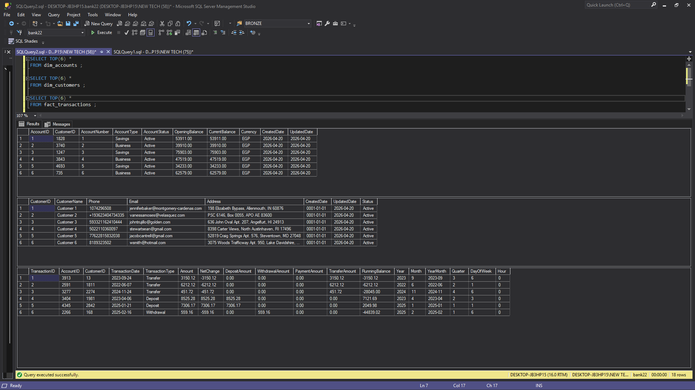

# 🏦 Banking ETL Pipeline

## Overview
This ETL pipeline processes raw banking data — cleaning, transforming, and loading it
into a structured SQL Server database ready for reporting and analysis.

---

## Dataset Descriptions

### 1. `customers.json`
Customer master data. Each record represents a registered bank customer.

| Field       | Type   | Description                        |
|-------------|--------|------------------------------------|
| CustomerID  | int    | Unique customer identifier (PK)    |
| FirstName   | str    | Customer first name                |
| LastName    | str    | Customer last name                 |
| Phone       | str    | Contact phone number               |
| Email       | str    | Contact email address              |
| Address     | str    | Residential address                |
| JoinDate    | epoch  | Account opening date (ms timestamp)|

**Risks:** Duplicate CustomerIDs, missing contact info, malformed email/phone formats.

---

### 2. `raw_accounts.csv`
Bank accounts linked to customers. One customer may have multiple accounts.

| Field       | Type   | Description                              |
|-------------|--------|------------------------------------------|
| AccountID   | int    | Unique account identifier (PK)           |
| CustomerID  | int    | Foreign key → customers                  |
| AccountType | str    | Savings / Checking / Business            |
| Balance     | float  | Current stored balance                   |
| CreatedDate | date   | Date the account was opened              |

**Risks:** Negative balances, orphaned accounts (CustomerID not in customers),
missing AccountID, invalid AccountType values.

---

### 3. `raw_transactions.csv`
Daily transactional records per account.

| Field           | Type   | Description                                      |
|-----------------|--------|--------------------------------------------------|
| TransactionID   | int    | Unique transaction identifier (PK)               |
| AccountID       | int    | Foreign key → accounts                           |
| TransactionType | str    | Deposit / Withdrawal / Transfer / Payment        |
| Amount          | float  | Transaction amount                               |
| TransactionDate | date   | Date the transaction occurred                    |

**Risks:** Duplicate TransactionIDs, zero or negative amounts, invalid TransactionType,
AccountID not linked to any account, future-dated transactions.

---

### 4. `raw_cards.csv`
Debit/Credit/Prepaid cards issued to customers.

| Field          | Type   | Description                         |
|----------------|--------|-------------------------------------|
| CardID         | int    | Unique card identifier (PK)         |
| CustomerID     | int    | Foreign key → customers             |
| CardType       | str    | Credit / Debit / Prepaid            |
| CardNumber     | str    | 16-digit card number                |
| IssuedDate     | date   | Card issue date                     |
| ExpirationDate | date   | Card expiry date                    |

**Risks:** Duplicate card numbers, expiration before issue date,
invalid CardType, orphaned CustomerID.

---

### 5. `raw_loans.csv`
Active and closed loans per customer.

| Field         | Type   | Description                          |
|---------------|--------|--------------------------------------|
| LoanID        | int    | Unique loan identifier (PK)          |
| CustomerID    | int    | Foreign key → customers              |
| LoanType      | str    | Car / Home / Personal                |
| LoanAmount    | float  | Principal loan amount                |
| InterestRate  | float  | Annual interest rate (%)             |
| LoanStartDate | date   | Loan disbursement date               |
| LoanEndDate   | date   | Loan maturity date                   |

**Risks:** End date before start date, zero/negative loan amounts,
invalid LoanType, orphaned CustomerID.

---

### 6. `raw_support_calls.csv`
Customer support call logs.

| Field      | Type   | Description                                        |
|------------|--------|----------------------------------------------------|
| CallID     | int    | Unique call identifier (PK)                        |
| CustomerID | int    | Foreign key → customers                            |
| CallDate   | date   | Date the call was made                             |
| IssueType  | str    | Account Access / Transaction Dispute / etc.        |
| Resolved   | str    | Yes / No — whether the issue was resolved          |

**Risks:** Missing Resolved flag, invalid IssueType values, orphaned CustomerID.

---

## Identified Data Quality Risks

| Risk                          | Affected Dataset(s)          | Severity |
|-------------------------------|------------------------------|----------|
| Missing primary key (ID)      | All                          | Critical |
| Negative/zero amounts         | Transactions, Loans          | High     |
| Duplicate records             | Transactions, Cards          | High     |
| Orphaned foreign keys         | Accounts, Transactions, etc. | High     |
| Invalid category values       | Transactions, Cards, Loans   | Medium   |
| Balance mismatch              | Accounts vs Transactions     | High     |
| Future-dated transactions     | Transactions                 | Medium   |
| Expired before issued (cards) | Cards                        | Medium   |
| Loan end before start         | Loans                        | Medium   |
| Epoch timestamp (JoinDate)    | Customers                    | Low      |

---

## ETL Steps

```
RAW DATA (CSV / JSON)
      │
      ▼
 [1] EXTRACT
      │  Read all CSV files and customers.json
      │  Parse into typed DataFrames per dataset
      │
      ▼
 [2] VALIDATE (Schema Check)
      │  Enforce expected columns and data types
      │  Reject rows that fail schema contract
      │
      ▼
 [3] CLEAN
      │  Drop rows with missing PKs
      │  Remove duplicate records
      │  Filter invalid amounts (≤ 0)
      │  Validate enum/category values
      │  Fix date formats & convert JoinDate epoch → date
      │  Flag orphaned foreign keys
      │
      ▼
 [4] TRANSFORM
      │  Separate deposits vs withdrawals
      │  Calculate total deposits / withdrawals per account
      │  Recalculate balance from transactions
      │  Detect balance mismatches → suspicious accounts
      │  Compute customer-level metrics
      │  Monthly activity summary
      │
      ▼
 [5] LOAD
      │  Insert dim_customers, dim_accounts, fact_transactions
      │  Upsert logic to prevent duplicates
      │  Write rejected rows to data/rejected/
      │
      ▼
 [6] AUDIT
       Log row counts: source → cleaned → loaded → rejected
       Fail pipeline if rejection rate > 20%
```

---

## Project Structure

```
bank_etl/
├── configs/
│   └── job_config.yaml          # Pipeline configuration
├── data/
│   ├── raw/                     # Input files (CSV + JSON)
│   ├── processed/               # Cleaned output files
    |       └── pre_code.ipynb it all process and then use py files           
│   └── rejected/                # Rejected rows with reasons
├── logs/                         # Daily log files
├──database/
         └──schema
          └──bank.bak                   
├── src/
│   ├── extract/
│   │   └── reader.py            # Reads raw CSV / JSON files
│   ├── transform/
│   │   ├── etl_rules.py         # clean() and transform() logic
│   │   └── schema_validator.py  # Schema enforcement
│   ├── load/
│   │   └── loader.py            # SQL Server loader
│   └── utils/
│       ├── config_loader.py     # YAML config parser
│       └── logger.py            # Centralised logging
├── pipeline.py                  # Orchestrates extract→clean→transform→load
├── main.py                      # Entry point
└── README.md
```

---


---
## 🗄️ Database Schema (Star Schema)



### dim_customers
Customer dimension table.

### dim_accounts
Account dimension table.

### fact_transactions
Transaction fact table.


